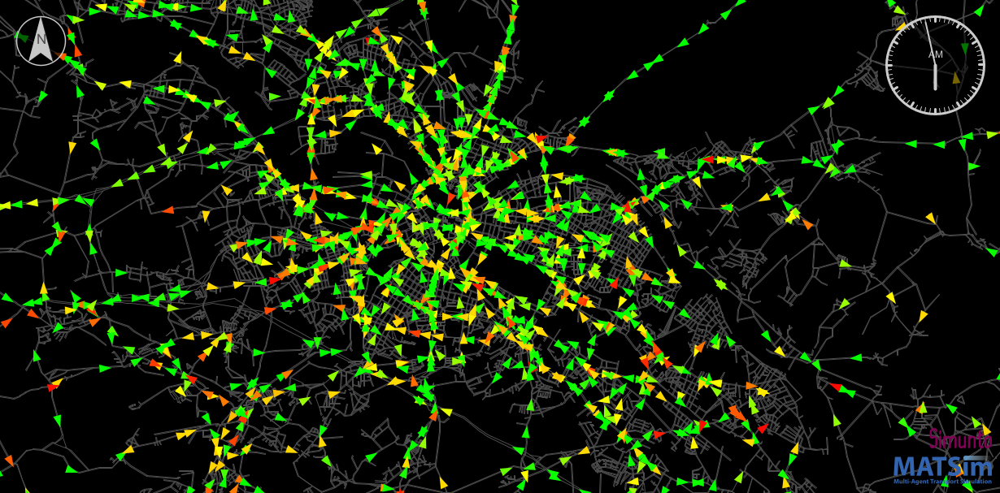

# The MATSim Open Dresden Scenario

### About this project

This repository provides an open MATSim transport model for Dresden, provided by the [Transport Systems Planning and Transport Telematics group](https://www.vsp.tu-berlin.de) of [Technische Universität Berlin](https://www.tu.berlin/).

This scenario contains a 10pct sample of Dresden and its surrounding area; road capacities are accordingly reduced. The scenario is calibrated taking into consideration the traffic counts, modal split and mode-specific trip distance distributions.

### Licenses

The **MATSim program code** in this repository is distributed under the terms of the [GNU Affero General Public License v3.0](https://www.gnu.org/licenses/agpl-3.0.html.en). The MATSim program code are files that reside in the `src` directory hierarchy and typically end with `*.java`.

The **MATSim input files, output files, analysis data and visualizations** are licensed under a <a rel="license" href="http://creativecommons.org/licenses/by/4.0/">Creative Commons Attribution 4.0 International License</a>.
  MATSim input files are those that are used as input to run MATSim. They often, but not always, have a header pointing to matsim.org. They typically reside in the `scenarios` directory hierarchy. MATSim output files, analysis data, and visualizations are files generated by MATSim runs, or by postprocessing.  They typically reside in a directory hierarchy starting with `output`.

**Other data files**, in particular in `original-input-data`, have their own individual licenses that need to be individually clarified with the copyright holders.

### Note

Handling of large files within git is not without problems (git lfs files are not included in the zip download; we have to pay; ...).  In consequence, large files, both on the input and on the output side, reside at https://svn.vsp.tu-berlin.de/repos/public-svn/matsim/scenarios/countries/de/dresden .

----
## Simple things (without installing/running MATSim)

### Use SimWrapper dashboards

1. Open SimWrapper at https://simwrapper.github.io/site/ .
1. Select Explore Data Sources -> VSP Public-SVN .
1. Navigate to de -> dresden -> output -> choose version (https://simwrapper.github.io/site/public/de/dresden/output/).
1. Enjoy the dashboards and visualizations.

### Run VIA on output files

1. Get VIA from https://www.simunto.com/via/.  (There is a free license for a small number of agents; that will probably work but only display a small number of vehicles/agents.)
1. Go to https://svn.vsp.tu-berlin.de/repos/public-svn/matsim/scenarios/countries/de/dresden/ .
1. Decide for a scenario that you find interesting (e.g. `v1.0`) and go into that directory.
1. Inside there, look for an `output-*` directory that you find interesting and go into that directory.
1. Download `*.output_network.xml.gz` and `*.output_events.xml.gz`.  Best make sure that they do not uncompress, e.g. by "Download linked file as ...".
1. Get these files into VIA.  This can be achieved in various ways; one is to open VIA and then drag the files from a file browser into VIA.
1. Run VIA and enjoy.

----

## Downloading the repository - Alternative 1: Download ZIP

1. Click on `Clone or download` and then on `Download ZIP`.
1. Unzip the repository.
1. Go to "Run the MATSim Dresden scenario" below.

## Downloading the repository - Alternative 2: Clone the repository

### Initial stuff (needs to be done once)

1. Install git for the command line.
1. Type `git clone https://github.com/matsim-scenarios/matsim-dresden.git` in the command line.

(Or use your IDE, e.g. Eclipse, IntelliJ, to clone the repository.)

This will result in a new `matsim-dresden` directory.  Memorize where you have put it.  You can move it, as a whole, to some other place.

### Update your local clone of the repository.

1. Go into the `matsim-dresden` directory.
1. Type `git pull`

(Or use your IDE, e.g. Eclipse, IntelliJ, to update the repository.)

This will update your repository to the newest version.

----
## Run the MATSim Dresden scenario ...

(Requires either cloning or downloading the repository.)

### ... using a runnable jar file

1. Depending on the version of matsim-dresden you have selected, you might have to create the jar file yourself.
    1. You can build an executable jar-file by executing one of the following commands in the top directory.
       This will download all necessary dependencies (it might take a while the first time it is run) and dump the jar into the top directory.
        1. `./mvnw clean package -DskipTests=true`
        1. or on Windows: `mvnw.cmd clean package -DskipTests=true`

1. Double-click on that .jar file (in a file system browser). Alternatively, try opening it with the following command:``
   java -jar [FILENAME].jar
   ``
1. A simple GUI should open.
1. In the GUI, click on the "Choose" button for configuration file.  Navigate to one of the `input` directories and load one of the configuration files.
1. Increase memory in the GUI.
1. Press the "Start MATSim" button.  This should run MATSim.  Note that MATSim accepts URLs as filenames in its config, so while the config files are part of the git repo, running them will pull additional material from our server.
1. "Open" the output directory.  You can drag files into VIA as was already done above.
1. "Edit..." (in the GUI) the config file.  Re-run MATSim.

### ... using an IDE, e.g. Eclipse, IntelliJ

1. Set up the project in your IDE.
1. Make sure the project is configured as maven project.
1. Run the JAVA class [RunDresdenScenario.java](src%2Fmain%2Fjava%2Forg%2Fmatsim%2Frun%2FRunDresdenScenario.java).
1. "Open" the output directory.  You can drag files into VIA as was already done above.
1. Edit the config file or adjust the run class. Re-run MATSim.

---
## More information

For more information about MATSim, see here: https://www.matsim.org/

### Internal Documentation
Internal documentation can be found here:
https://docs.google.com/document/d/1JjJqucnhMqZQ45vxO-50a92JSIlCcyYFghAol85lc2E/edit?tab=t.0